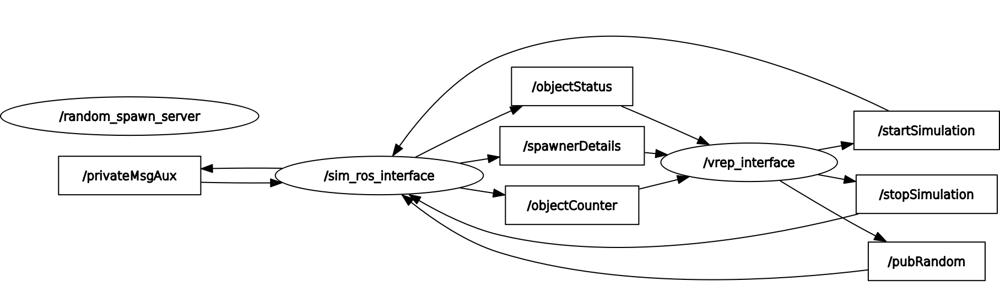

# SofAR Assignment
This folder will present the material related to the assignment of the Software Architectures for Robotics course at the University of Genova. This assignment is done by Group 11 and members of the group are Jerin Joy, Niva Binesh and Yeshwanth Guru Krishnakumar. 

## Description of the Assignment
The assignment describes a Software architecture and a simulation environment to enable a robot manipulator to sort objects coming on a conveyor belt depending on their color in their correct box. The simulation of the pick and place task of the robot is done in Coppeliasim and the control of the simulation is done with the help of ROS nodes. Three objects (an oil tray, fuel pump and camshaft) will be spawned in a conveyor and the robot based on RPP configuration will detect its color and pick the object and place it in its respective conveyor. 

## Node Structure


* /sim_ros_interface - ROS interface plugin for Coppeliasim
* /objectCounter - Topic that is used to count the number of objects spawned.
* /spawnerDetails - Topic that is used to obtain the details of the spawned objects.
* /objectStatus - Topic that is used to obtain the current status of the objects in the conveyor.
* /vrep_interface - Coppeliasim interface.
* /startSimulation - Topic that is used to start the simulation in Coppeliasim.
* /stopSimulation - Topic that is used to stop the simulation in Coppeliasim.

## Prerequisites
To successfully compile and run the assignment, you should have these installed:
* ROS noetic
* Coppeliasim V4.2+
* simExtROS package
* Python 3.8+

## Simulation Demo

## Building and Running

Navigate to the ROS workspace folder and follow these steps:

### Compiling SimExtROS Package

_NOTE:_ the directory containing all files (i.e. package.xml etc) must be called sim_ros_interface, otherwise build will fail.

1. Install required packages for [libPlugin](https://github.com/CoppeliaRobotics/libPlugin): see libPlugin's README.

2. Clone SimExtROS to the src folder of your ROS workspace
```
 git clone --recursive https://github.com/CoppeliaRobotics/simExtROS.git sim_ros_interface
```
3. Compile
```
 export COPPELIASIM_ROOT_DIR=~/path/to/coppeliaSim/folder
 catkin_make
```
4. Copy the devel/lib/libsimExtROS.so file to the CoppeliaSim installation folder. The plugin is now ready to be used!

### Compiling the Sofar Assignment

1. Open a new terminal and clone this repository into the src folder of your ROS workspace
```
 git clone https://github.com/jerin-joy/sofar_assignment.git

```
2. Build the workspace
```
 catkin_make
```
3. Start the ROS master in the background.
```
 roscore &
```
4. Run the node
```
 rosrun sofar_assignment vrep_interface.py
```
### Opening Coppeliasim Environment
1. Open a new terminal and source the ROS workspace.
2. Navigate to the Coppeliasim folder and start the coppeliasim
```
 ./coppeliaSim.sh
```
3. Load the [sofar_group11.ttt](sofar_group11.ttt) scene in Coppeliasim. 


